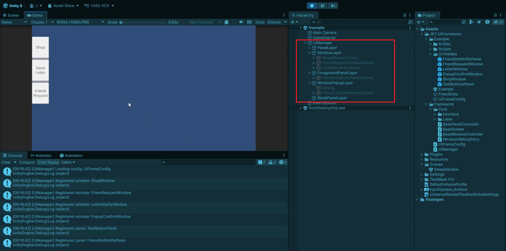
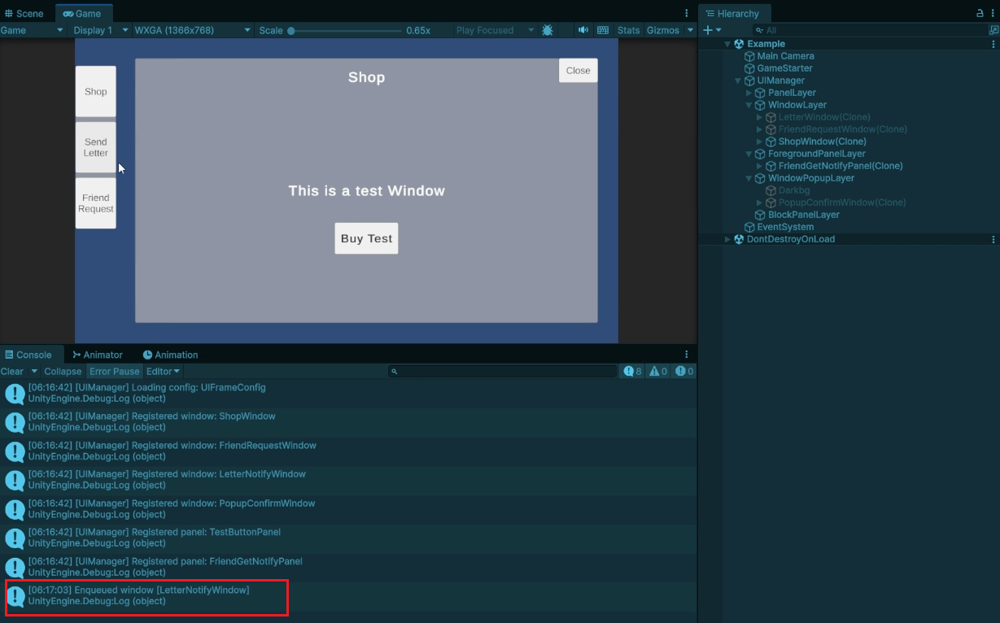
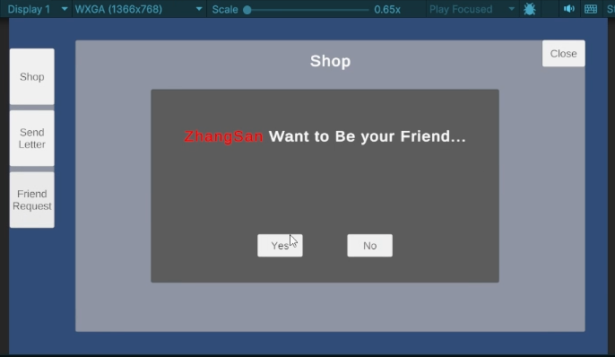
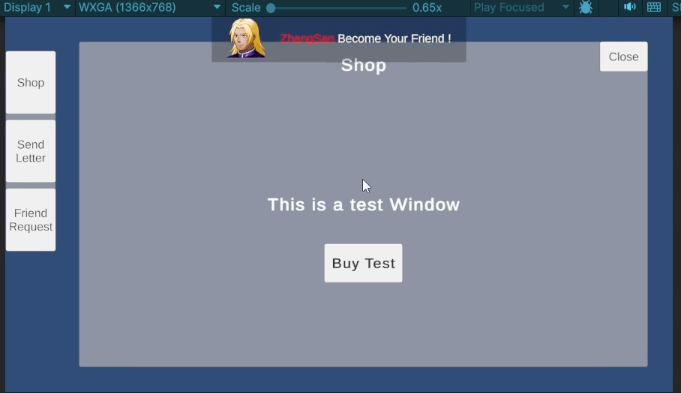

# JKY Simple UIFramework
手搓UI小框架

# 功能演示

Layer管理

入队等待显示

点击SendLetter，该窗口入队，关闭Shop窗口后Letter窗口自动显示

通知面板

FriendRequest窗口选择同意后ShowPanel

Inspired by [deVoid UI Framework](https://github.com/yankooliveira/uiframework)